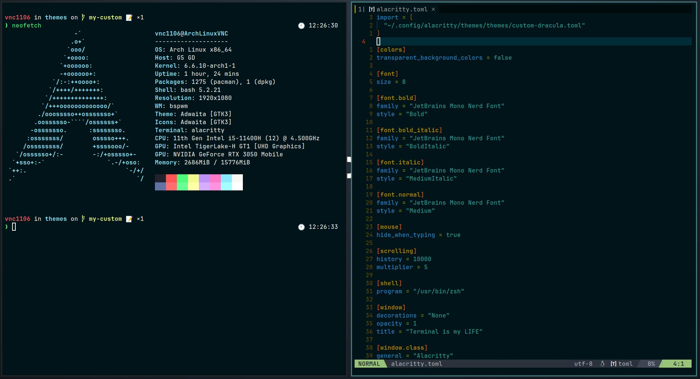

# Alacritty Themes

- Collection of colorschemes from [alacritty-theme](https://github.com/alacritty/alacritty-theme) repository.
- Added my customized themes.

## Installation

Clone the repository, or download the theme of your choice:

```bash
# We use Alacritty's default Linux config directory as our storage location here.
mkdir -p ~/.config/alacritty/themes
git clone https://github.com/viensea1106/alacritty-theme.git ~/.config/alacritty/themes && cd themes
git checkout my-custom
```

Add an import to your `alacritty.toml` (Replace `{theme}`  with your desired colorscheme):

```toml
import = [
    "~/.config/alacritty/themes/themes/{theme}.toml"
]
```

## Color Schemes

### custom-dracula.toml

Change background color to [solarized-osaka](https://github.com/craftzdog/solarized-osaka.nvim)

<p align="center">
    
</p>
